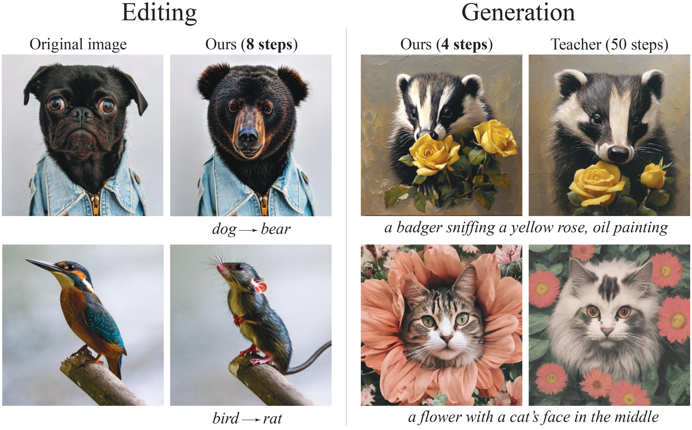
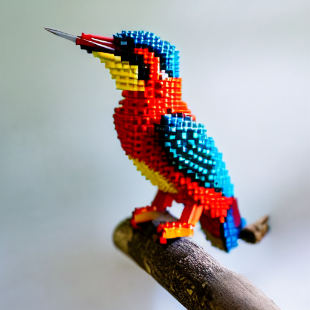

# Invertible Consistency Distillation for <br> Text-Guided Image Editing in Around 7 Steps

<a href='https://arxiv.org/abs/2406.14539'></a> &nbsp; 
<a href='https://yandex-research.github.io/invertible-cd/'></a> &nbsp; 
<a href="https://huggingface.co/spaces/dbaranchuk/iCD-image-generation">
	    
</a>&nbsp;
<a href="https://huggingface.co/spaces/dbaranchuk/iCD-image-editing">
	    
</a>&nbsp;

This paper proposes **invertible Consistency Distillation**, enabling

1. highly efficient and accurate **text-guided image editing**
2. diverse and high-quality **image generation**

<p align="center">

</p>

## Table of contents

* [Installation](#installation)
* [Easy-to-run examples](#easy-to-run-examples) (iCD-SD1.5)
    * [Generation](#generation-with-sd15)
    * [Editing](#editing-with-sd15)
* [Easy-to-run examples](running/sdxl) (iCD-SDXL)
* [In-depth generation and editing](running) (iCD-SDXL and iCD-SD1.5)
* [iCD training example](training) (iCD-SDXL and iCD-SD1.5)
* [Citation](#citation)

## Installation

```shell
# Clone a repo
git clone https://github.com/yandex-research/invertible-cd

# Create an environment and install packages
conda create -n icd python=3.10 -y 
conda activate icd

pip3 install -r requirements/req.txt
```
We provide the following checkpoints:

1. Guidance distilled diffusion models
    - [Stable Diffusion 1.5, 3GB](https://storage.yandexcloud.net/yandex-research/invertible-cd/sd15_cfg_distill.pt.tar.gz
      )
    - [SDXL, 8.9GB](https://storage.yandexcloud.net/yandex-research/invertible-cd/sdxl_cfg_distill.pt.tar.gz)

These models saved as `.pt` files.

2. Invertible Consistency Distillation (_forward_ and _reverse_ CD) on top of the guidance distilled models

| Model                                                                                                     | Steps | Time steps                                                       |
|-----------------------------------------------------------------------------------------------------------|-------|------------------------------------------------------------------|
| [iCD-SD1.5, 0.5GB](https://storage.yandexcloud.net/yandex-research/invertible-cd/iCD-SD15_4steps_1.tar.gz)        | 4     | Reverse: [259, 519, 779, 999]; <br> Forward: [19, 259, 519, 779] |
| [iCD-SD1.5, 0.5GB](https://storage.yandexcloud.net/yandex-research/invertible-cd/iCD-SD15_4steps_2.tar.gz)        | 4     | Reverse: [249, 499, 699, 999]; <br> Forward: [19, 249, 499, 699] |
| [iCD-SD1.5, 0.5GB](https://storage.yandexcloud.net/yandex-research/invertible-cd/iCD-SD15_3steps.tar.gz)         | 3     | Reverse: [339, 699, 999]; <br> Forward: [19, 339, 699]           |
| [iCD-SDXL, 1.4GB](https://storage.yandexcloud.net/yandex-research/invertible-cd/iCD-SDXL_4steps_1.tar.gz) | 4     | Reverse: [259, 519, 779, 999]; <br> Forward: [19, 259, 519, 779] |
| [iCD-SDXL, 1.4GB](https://storage.yandexcloud.net/yandex-research/invertible-cd/iCD-SDXL_4steps_2.tar.gz) | 4     | Reverse: [249, 499, 699, 999]; <br> Forward: [19, 249, 499, 699] |
| [iCD-SDXL, 1.4GB](https://storage.yandexcloud.net/yandex-research/invertible-cd/iCD-SDXL_3steps.tar.gz)   | 3     | Reverse: [339, 699, 999]; <br> Forward: [19, 339, 699]           |

These models saved as `.safetensors` files.

## Easy-to-run examples

<b>Step 0. Download the models and put them to the *checkpoints* folder</b>

For this example, we consider [iCD-SD1.5](https://storage.yandexcloud.net/yandex-research/invertible-cd/iCD-SD1.5_1.tar) using
reverse: [259, 519, 779, 999], forward: [19, 259, 519, 779] time steps.

<b>Step 1. Load the models </b>

```Python
from utils.loading import load_models
from diffusers import DDPMScheduler

root = 'checkpoints'
ldm_stable, reverse_cons_model, forward_cons_model = load_models(
    model_id="runwayml/stable-diffusion-v1-5",
    device='cuda',
    forward_checkpoint=f'{root}/iCD-SD15-forward_19_259_519_779.safetensors',
    reverse_checkpoint=f'{root}/iCD-SD15-reverse_259_519_779_999.safetensors',
    r=64,
    w_embed_dim=512,
    teacher_checkpoint=f'{root}/sd15_cfg_distill.pt',
)

tokenizer = ldm_stable.tokenizer
noise_scheduler = DDPMScheduler.from_pretrained(
    "runwayml/stable-diffusion-v1-5", subfolder="scheduler", )
```

<b>Step 2. Specify the configuration according to the downloaded model</b>

```Python
from utils import p2p, generation

NUM_REVERSE_CONS_STEPS = 4
REVERSE_TIMESTEPS = [259, 519, 779, 999]
NUM_FORWARD_CONS_STEPS = 4
FORWARD_TIMESTEPS = [19, 259, 519, 779]
NUM_DDIM_STEPS = 50

solver = generation.Generator(
    model=ldm_stable,
    noise_scheduler=noise_scheduler,
    n_steps=NUM_DDIM_STEPS,
    forward_cons_model=forward_cons_model,
    forward_timesteps=FORWARD_TIMESTEPS,
    reverse_cons_model=reverse_cons_model,
    reverse_timesteps=REVERSE_TIMESTEPS,
    num_endpoints=NUM_REVERSE_CONS_STEPS,
    num_forward_endpoints=NUM_FORWARD_CONS_STEPS,
    max_forward_timestep_index=49,
    start_timestep=19)

p2p.NUM_DDIM_STEPS = NUM_DDIM_STEPS
p2p.tokenizer = tokenizer
p2p.device = 'cuda'
```

### Generation with iCD-SD1.5

<b>Step 3. Generate</b>

```Python
import torch

prompt = ['a cute owl with a graduation cap']
controller = p2p.AttentionStore()

generator = torch.Generator().manual_seed(150)
tau = 1.0
image, _ = generation.runner(
    # Playing params
    guidance_scale=19.0,
    tau1=tau,  # Dynamic guidance if tau < 1.0
    tau2=tau,

    # Fixed params
    is_cons_forward=True,
    model=reverse_cons_model,
    w_embed_dim=512,
    solver=solver,
    prompt=prompt,
    controller=controller,
    generator=generator,
    latent=None,
    return_type='image')

# The left image is inversion, the right - editing.
generation.to_pil_images(image).save('test_generation_iCD-SD1.5.jpg')
generation.view_images(image)
```

<p align="center">

</p>

### Editing with iCD-SD1.5

<b>Step 3. Load and invert real image</b>

```Python
from utils import inversion

image_path = f"assets/bird.jpg"
prompt = ["a photo of a bird standing on a branch"]

(image_gt, image_rec), ddim_latent, uncond_embeddings = inversion.invert(
    # Playing params
    image_path=image_path,
    prompt=prompt,

    # Fixed params
    is_cons_inversion=True,
    w_embed_dim=512,
    inv_guidance_scale=0.0,
    stop_step=50,
    solver=solver,
    seed=10500)
```

<p align="center">

</p>

<b>Step 4. Edit the image</b>

```Python
p2p.NUM_DDIM_STEPS = 4
p2p.tokenizer = tokenizer
p2p.device = 'cuda'

prompts = ["a photo of a bird standing on a branch",
           "a photo of a lego bird standing on a branch"
           ]

# Playing params
cross_replace_steps = {'default_': 0.2, }
self_replace_steps = 0.2
blend_word = ((('bird',), ('lego',)))
eq_params = {"words": ("lego",), "values": (3.,)}

controller = p2p.make_controller(prompts,
                                 False, # (is_replacement) True if only one word is changed
                                 cross_replace_steps,
                                 self_replace_steps,
                                 blend_word,
                                 eq_params)

tau = 0.8
image, _ = generation.runner(
    # Playing params
    guidance_scale=19.0,
    tau1=tau,  # Dynamic guidance if tau < 1.0
    tau2=tau,

    # Fixed params
    model=reverse_cons_model,
    is_cons_forward=True,
    w_embed_dim=512,
    solver=solver,
    prompt=prompts,
    controller=controller,
    num_inference_steps=50,
    generator=None,
    latent=ddim_latent,
    uncond_embeddings=uncond_embeddings,
    return_type='image')

generation.to_pil_images(image).save('test_editing_iCD-SD1.5.jpg')
generation.view_images(image)
```

<p align="center">

</p>

>**Note**: <br>
Please note that zero-shot editing is highly sensitive to hyperparameters. Thus, we recommend tuning: cross_replace_steps 
> (from 0.0 to 1.0), self_replace_steps (from 0.0 to 1), tau (0.7 or 0.8 seems to work best), 
> guidance scale (up to 19), and amplify factor (eq_params).

You can also consider the similar easy-to-run examples for the [SDXL model](running/sdxl)
or move on to [in-depth examples](running)

## Citation

```bibtex
@article{starodubcev2024invertible,
  title={Invertible Consistency Distillation for Text-Guided Image Editing in Around 7 Steps},
  author={Starodubcev, Nikita and Khoroshikh, Mikhail and Babenko, Artem and Baranchuk, Dmitry},
  journal={arXiv preprint arXiv:2406.14539},
  year={2024}
}
```
