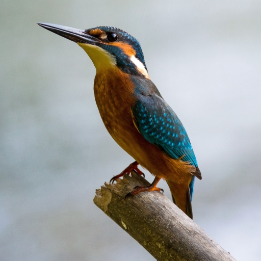
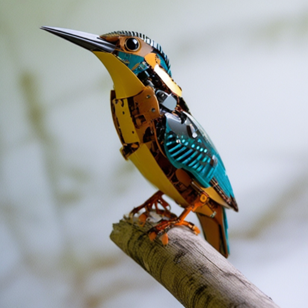

<b>Step 0. Download the models and put them to the *checkpoints* folder</b>

For this example, we consider [iCD-SDXL](https://storage.yandexcloud.net/yandex-research/invertible-cd/iCD-SDXL_4steps_2.tar.gz) using
reverse: [249, 499, 699, 999], forward: [19, 249, 499, 699] time steps.

<b>Step 1. Load the models </b>

```Python
# import sys
# Probably, you will need to specify the python path
# sys.path.append('<main_root>')

import torch
import functools
from utils import generation_sdxl
from utils.loading import load_models_xl
from PIL import Image

model_id = 'stabilityai/stable-diffusion-xl-base-1.0'
reverse_checkpoint = 'checkpoints/iCD-SDXL-reverse_249_499_699_999.safetensors'
forward_checkpoint = 'checkpoints/iCD-SDXL-forward_19_249_499_699.safetensors'
teacher_checkpoint = 'checkpoints/sdxl_cfg_distill.pt'

stable_pipe, reverse_pipe, forward_pipe = load_models_xl(model_id=model_id,
                                                         reverse_checkpoint=reverse_checkpoint,
                                                         forward_checkpoint=forward_checkpoint,
                                                         teacher_checkpoint=teacher_checkpoint)

text_encoders = [reverse_pipe.text_encoder, reverse_pipe.text_encoder_2]
tokenizers = [reverse_pipe.tokenizer, reverse_pipe.tokenizer_2]

compute_embeddings_fn = functools.partial(
        generation_sdxl.compute_embeddings,
        proportion_empty_prompts=0,
        text_encoders=text_encoders,
        tokenizers=tokenizers,
    )
```

### Generation with iCD-XL

<b>Step 2. Generate</b>

```Python
generator = torch.Generator(device="cpu").manual_seed(0)
prompt = ['Long-exposure night photography of a starry sky over a mountain range, with light trails.']

images = generation_sdxl.sample_deterministic(
            reverse_pipe,
            prompt,
            num_inference_steps=4,
            generator=generator,
            guidance_scale=7.0,
            is_sdxl=True,
            timesteps=[249, 499, 699, 999],
            use_dynamic_guidance=False,
            tau1=1.0,
            tau2=1.0,
            compute_embeddings_fn=compute_embeddings_fn
        )
images[0].save('test_generation_sdxl.jpg')
```

<p align="center">

</p>

### Editing with iCD-XL

<b>Step 2. Load and invert real image</b>

```Python
init_image = Image.open(f'assets/bird.jpg').resize((1024, 1024))
init_image = forward_pipe.image_processor.preprocess(init_image)
orig_prompt = 'a photo of a bird standing on a branch'
generator = torch.Generator(device="cuda").manual_seed(0)

latents = generation_sdxl.inverse_sample_deterministic(
            forward_pipe,
            init_image,
            [orig_prompt],
            num_inference_steps=4,
            timesteps=[19, 249, 499, 699],
            generator=generator,
            guidance_scale=0.0,
            is_sdxl=True,
            compute_embeddings_fn=compute_embeddings_fn,
            seed=0
        )
```
<p align="center">

</p>

<b>Step 4. Edit the image</b>

```Python
edited_prompt = 'a photo of a robotic bird standing on a branch'
images = generation_sdxl.sample_deterministic(
            reverse_pipe,
            [edited_prompt],
            
            # Playing params
            amplify_prompt=[orig_prompt], # If orig_prompt, then preserve the original image more
                                          # If edited_prompt, then amplify the editing more
            guidance_scale=7.0,           # If you need to amplify editing strength, try larger
            use_dynamic_guidance=True,    # True is necessary to preserve the original image.
            tau1=0.7,
            tau2=0.7,
    
            # Fixed params
            num_inference_steps=4,
            timesteps=[249, 499, 699, 999],
            generator=generator,
            latents=latents,
            is_sdxl=True,
            compute_embeddings_fn=compute_embeddings_fn,
        )
images[0].save('test_editing_sdxl.jpg')
```
<p align="center">

</p>
